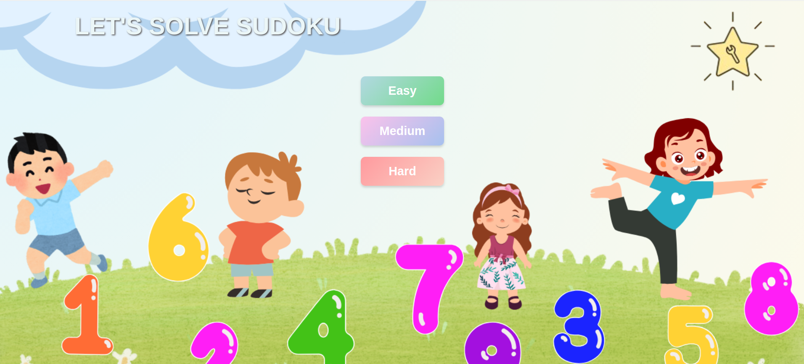
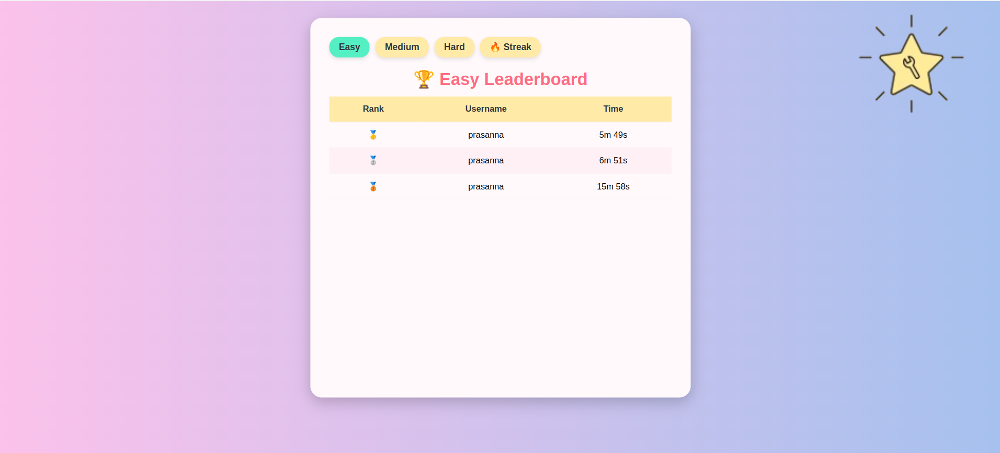
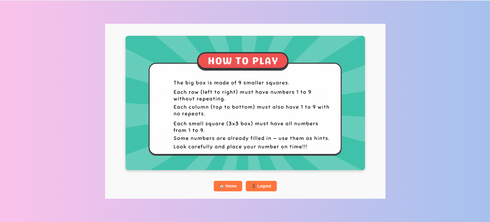
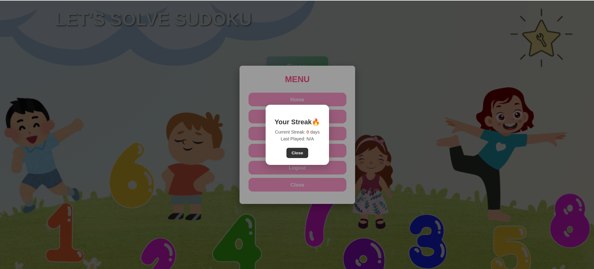

# 🧠 Let's solve sudoku — Frontend (React)

This is the **React-based frontend** of the Sudoku Solver — a fun, kid-friendly Sudoku game with save/resume, streak tracking, and animated UI.

---

## 🔗 Website is now live on Vercel and Railway  
👉 [Sudoku Game for kids](https://sudokugameforkids.vercel.app/)

## 🔗 Backend Repo  
👉 [Sudoku Backend](https://github.com/PrasannaLanka/sudokusolver-backend.git)

---


## 🎨 Features

- 🎮 Choose difficulty: Easy, Medium, Hard
- 💾 Save and resume your last session
- 🔥 Track your daily streak
- ⏱️ Built-in game timer
- 👤 JWT-based login/signup
- 📱 Fully responsive on all devices
- 💡 Help guide with GIF walkthroughs
- 🧾 Leaderboard with difficulty filter

---

## 📸 Screenshots

### 🎮 Login Page  


### 🎮 Home Page  


### 🧠 Game Board  


### 📊 Leaderboard  


### 🙋 Help Page  


### 🙋 Menu and streak 


---

## 🛠 Tech Stack

- React
- React Router DOM
- Axios
- CSS
---

## ⚙️ Setup Instructions

```bash
git clone https://github.com/PrasannaLanka/sudokusolver-frontend.git
cd sudoku-frontend
npm install
npm start
